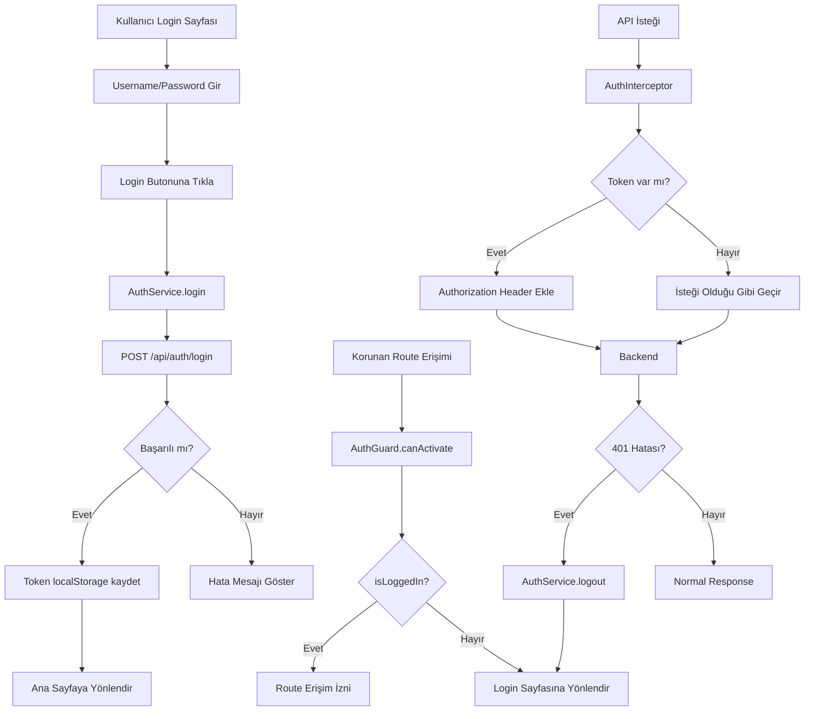

# Backend Auth Entegrasyon Planı

## Mevcut Durum Analizi

### Tamamlanmış Hazırlıklar
- ✅ [`environment.ts`](frontend/src/environments/environment.ts:1) - apiUrl: `http://localhost:8080/api` (doğru)
- ✅ [`core.module.ts`](frontend/src/app/core/core.module.ts:1) - HTTP_INTERCEPTORS provider zaten yapılandırılmış
- ✅ [`auth.interceptor.ts`](frontend/src/app/core/interceptors/auth.interceptor.ts:1) - Boş şablon mevcut
- ✅ [`auth.guard.ts`](frontend/src/app/core/guards/auth.guard.ts:1) - Boş şablon mevcut  
- ✅ [`auth.service.ts`](frontend/src/app/core/services/auth.service.ts:1) - İskelet metodlar mevcut
- ✅ [`app-routing-module.ts`](frontend/src/app/app-routing-module.ts:1) - Home ve NotFound route'ları mevcut

### Eksik Bileşenler
- ❌ `src/app/models/auth.model.ts` - Auth DTO interface'leri
- ❌ Login feature modülü ve component'i
- ❌ `/login` route tanımı

---

## Uygulama Adımları

### Adım 1: Auth DTO Interface Oluştur

**Dosya:** `src/app/models/auth.model.ts`

```typescript
export interface LoginRequest {
  username: string;
  password: string;
}

export interface LoginResponse {
  token: string;
}
```

**Not:** Backend endpoint yapısına uygun DTO tanımları.

---

### Adım 2: Auth Service Doldur

**Dosya:** `src/app/core/services/auth.service.ts`

**Değişiklikler:**
1. `HttpClient` ve `Router` inject et
2. `environment.apiUrl` kullan
3. Metodları implement et:
   - `login(username: string, password: string): Observable<LoginResponse>` - POST `/auth/login`
   - `logout(): void` - localStorage temizle, `/login` yönlendir
   - `getToken(): string | null` - localStorage'dan oku
   - `setToken(token: string): void` - localStorage'a yaz
   - `isLoggedIn(): boolean` - Token varlık kontrolü

**Bağımlılıklar:**
- `@angular/common/http` - HttpClient
- `@angular/router` - Router
- `rxjs` - Observable
- `../../environments/environment` - apiUrl
- `../../models/auth.model` - LoginRequest, LoginResponse

---

### Adım 3: Auth Interceptor Doldur

**Dosya:** `src/app/core/interceptors/auth.interceptor.ts`

**Değişiklikler:**
1. `AuthService` inject et
2. `intercept()` metodunda:
   - `AuthService.getToken()` ile token al
   - Token varsa: `Authorization: Bearer {token}` header ekle
   - Token yoksa: request'i olduğu gibi geçir
3. 401 hatası durumunda `AuthService.logout()` çağır

**Önemli:** `catchError` ile 401 handling yapılmalı.

---

### Adım 4: Auth Guard Doldur

**Dosya:** `src/app/core/guards/auth.guard.ts`

**Değişiklikler:**
1. `Router` ve `AuthService` inject et
2. `canActivate()` metodunda:
   - `AuthService.isLoggedIn()` true ise → `true` döndür
   - false ise → `Router.navigate(['/login'])` çağır, `false` döndür

---

### Adım 5: Core Module Kontrolü

**Dosya:** `src/app/core/core.module.ts`

**Mevcut Durum:** ✅ Zaten yapılandırılmış
```typescript
providers: [
  { provide: HTTP_INTERCEPTORS, useClass: AuthInterceptor, multi: true }
]
```

**İşlem:** Değişiklik gerekmez.

---

### Adım 6: Login Feature Oluştur

**Klasör:** `src/app/features/login/`

#### 6.1 Login Module
**Dosya:** `src/app/features/login/login.module.ts`

**Import Edilecek Modüller:**
- `CommonModule`
- `FormsModule`
- `ReactiveFormsModule`
- `MatCardModule`
- `MatFormFieldModule`
- `MatInputModule`
- `MatButtonModule`

#### 6.2 Login Routing Module
**Dosya:** `src/app/features/login/login-routing.module.ts`

**Route Tanımı:** `{ path: '', component: LoginComponent }`

#### 6.3 Login Component
**Dosyalar:**
- `src/app/features/login/components/login.component.ts`
- `src/app/features/login/components/login.component.html`
- `src/app/features/login/components/login.component.css`

**Component Özellikleri:**
- Ortalanmış `mat-card` içinde login formu
- `mat-form-field` ile username ve password input'ları
- Login butonu
- Submit → `AuthService.login()` çağır
- Başarılı → Token kaydet, `/` yönlendir
- Başarısız → Hata mesajı göster

---

### Adım 7: App Routing Güncelleme

**Dosya:** `src/app/app-routing.module.ts`

**Eklenecek Route:**
```typescript
{ path: 'login', loadChildren: () => import('./features/login/login.module').then(m => m.LoginModule) }
```

**Not:** Login route AuthGuard olmaz - herkes girebilir.

---

### Adım 8: Environment Kontrolü

**Dosya:** `src/app/environments/environment.ts`

**Mevcut:** ✅ `apiUrl: 'http://localhost:8080/api'` (doğru)

**İşlem:** Değişiklik gerekmez.

---

## Akış Diyagramı



---

## Güvenlik Notları

1. **Token Saklama:** localStorage kullanılıyor - XSS saldırılarına karşı dikkatli olunmalı
2. **HTTPS:** Production'da HTTPS zorunlu olmalı
3. **Token Expiry:** Şu an için token süresi kontrolü yok - ileride eklenebilir

---

## Test Senaryoları

1. **Başarılı Login:**
   - Geçerli credentials gir
   - Token localStorage'da saklanmalı
   - Ana sayfaya yönlendirilmeli

2. **Başarısız Login:**
   - Geçersiz credentials gir
   - Hata mesajı görünmeli
   - Login sayfasında kalmalı

3. **Token ile API Erişimi:**
   - Login olduktan sonra korunan route'a eriş
   - Authorization header eklenmeli

4. **401 Handling:**
   - Token süresi dolunca logout olmalı
   - Login sayfasına yönlendirilmeli

---

## Onay Gerektiren Noktalar

Her adım tamamlandıktan sonra DUR ve kullanıcı onayı bekle.
Sonraki adıma geçmeden önce kullanıcı "devam" demeli.
