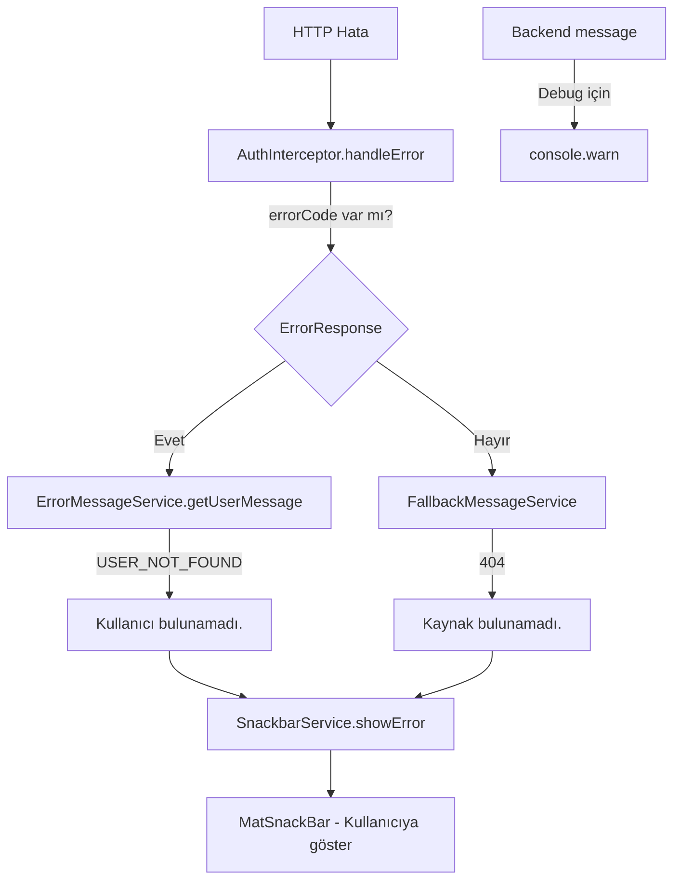

# ErrorCode Entegrasyon Planı — Backend'den Gelen ErrorCode Kullanımı

## Backend Değişiklikleri

Backend artık `ErrorResponse` DTO'suna `errorCode` alanı ekledi:

```json
{
  "statusCode": 404,
  "errorCode": "USER_NOT_FOUND",
  "message": "user, username:adas değeri ile bulunamadı.",
  "timestamp": "2025-01-01T12:00:00"
}
```

### EErrorCode Enum Değerleri
```
INTERNAL_SERVER_ERROR
USER_NOT_FOUND
ADMIN_NOT_FOUND
SELLER_NOT_FOUND
SHOPPER_NOT_FOUND
ITEM_NOT_FOUND
USERTYPE_NOT_FOUND
VALIDATION_ERROR
```

---

## Frontend Mimari Tasarımı

### Yeni Yapı


### Katmanlar
1. **Models** — `EErrorCode` enum + `ErrorResponse` interface'e `errorCode` alanı
2. **ErrorMessageService** — `errorCode` → Türkçe kullanıcı mesajı mapping
3. **AuthInterceptor** — `errorCode` varsa ErrorMessageService kullan, yoksa fallback
4. **LoginComponent** — errorCode ile insani mesaj (form altında)

---

## Adım Adım Değişiklikler

### Adım 1: models/error.model.ts Güncelle

**Ekle:**
- `EErrorCode` enum (backend ile aynı değerler)
- `ErrorResponse` interface'e `errorCode` alanı

```typescript
export enum EErrorCode {
  INTERNAL_SERVER_ERROR = 'INTERNAL_SERVER_ERROR',
  USER_NOT_FOUND = 'USER_NOT_FOUND',
  ADMIN_NOT_FOUND = 'ADMIN_NOT_FOUND',
  SELLER_NOT_FOUND = 'SELLER_NOT_FOUND',
  SHOPPER_NOT_FOUND = 'SHOPPER_NOT_FOUND',
  ITEM_NOT_FOUND = 'ITEM_NOT_FOUND',
  USERTYPE_NOT_FOUND = 'USERTYPE_NOT_FOUND',
  VALIDATION_ERROR = 'VALIDATION_ERROR'
}

export interface ErrorResponse {
  statusCode: number;
  errorCode: EErrorCode;  // YENİ
  message: string;
  timestamp: string;
  validationErrors: ValidationErrorResponse[] | null;
}
```

---

### Adım 2: core/services/error-message.service.ts Oluştur

**Yeni service:**

```typescript
@Injectable({ providedIn: 'root' })
export class ErrorMessageService {
  /**
   * Backend'den gelen errorCode'a göre kullanıcı dostu Türkçe mesaj döner
   */
  getUserMessage(errorCode: EErrorCode, fallbackMessage?: string): string {
    const messages: Record<EErrorCode, string> = {
      [EErrorCode.INTERNAL_SERVER_ERROR]: 'Sunucuda beklenmeyen bir hata oluştu.',
      [EErrorCode.USER_NOT_FOUND]: 'Kullanıcı bulunamadı.',
      [EErrorCode.ADMIN_NOT_FOUND]: 'Yönetici bulunamadı.',
      [EErrorCode.SELLER_NOT_FOUND]: 'Satıcı bulunamadı.',
      [EErrorCode.SHOPPER_NOT_FOUND]: 'Alışverişçi bulunamadı.',
      [EErrorCode.ITEM_NOT_FOUND]: 'Ürün bulunamadı.',
      [EErrorCode.USERTYPE_NOT_FOUND]: 'Kullanıcı tipi bulunamadı.',
      [EErrorCode.VALIDATION_ERROR]: 'Girdiğiniz bilgilerde hatalar var.'
    };

    return messages[errorCode] ?? fallbackMessage ?? 'Beklenmeyen bir hata oluştu.';
  }

  /**
   * Validation error'larını formatlı string olarak döner
   * Örn: "username: zorunlu alan, email: geçersiz format"
   */
  formatValidationErrors(validationErrors: ValidationErrorResponse[]): string {
    return validationErrors
      .map(ve => `${ve.field}: ${ve.message}`)
      .join(', ');
  }
}
```

---

### Adım 3: core/interceptors/auth.interceptor.ts Güncelle

**Değiştir:**
- `ErrorMessageService` inject et
- `extractErrorMessage` metodunda `errorCode` kontrolü ekle
- Backend `message`'ını `console.warn` ile logla (debug için)

```typescript
private extractErrorMessage(error: HttpErrorResponse): string {
  // Backend ErrorResponse body'sini parse et
  if (error.error?.statusCode !== undefined && error.error?.errorCode !== undefined) {
    const errorResponse = error.error as ErrorResponse;

    // Backend mesajını debug için logla (teknik detay)
    console.warn('[Backend Error]', errorResponse.message);

    // Validation error'ları formatla
    if (errorResponse.validationErrors && errorResponse.validationErrors.length > 0) {
      const validationMessages = this.errorMessageService.formatValidationErrors(errorResponse.validationErrors);
      return `${errorResponse.message} — ${validationMessages}`;
    }

    // errorCode'a göre kullanıcı dostu mesaj
    return this.errorMessageService.getUserMessage(errorResponse.errorCode, errorResponse.message);
  }

  // Backend ErrorResponse formatına uymayan hatalar (fallback)
  // ... mevcut fallback mantığı koru
}
```

---

### Adım 4: features/login/components/login.component.ts Güncelle

**Değiştir:**
- `ErrorResponse` interface'i kullan
- `errorCode` kontrolü ile insani mesaj

```typescript
error: (error: HttpErrorResponse) => {
  if (error.error?.statusCode !== undefined && error.error?.errorCode !== undefined) {
    const errorResponse = error.error as ErrorResponse;

    // errorCode'a göre kullanıcı dostu mesaj
    if (errorResponse.errorCode === EErrorCode.USER_NOT_FOUND) {
      this.errorMessage = 'Kullanıcı adı veya şifre hatalı.';
    } else if (errorResponse.errorCode === EErrorCode.VALIDATION_ERROR) {
      this.errorMessage = 'Lütfen tüm alanları doldurun.';
    } else {
      this.errorMessage = errorResponse.message;
    }
  } else {
    this.errorMessage = 'Giriş başarısız. Lütfen bilgilerinizi kontrol edin.';
  }
}
```

---

## Değişecek Dosyalar Özeti

| Dosya | İşlem | Açıklama |
|---|---|---|
| `models/error.model.ts` | **GÜNCELLE** | EErrorCode enum + errorCode alanı |
| `core/services/error-message.service.ts` | **YENİ** | errorCode → Türkçe mesaj mapping |
| `core/interceptors/auth.interceptor.ts` | **GÜNCELLE** | errorCode ile ErrorMessageService kullanımı |
| `features/login/components/login.component.ts` | **GÜNCELLE** | errorCode ile insani mesaj |
| `.roo/CONTEXT.md` | **GÜNCELLE** | ErrorCode entegrasyonu belgesi |
| `.roo/rules.md` | **KONTROL** | Yeni kural gerekli mi? |

---

## Kullanıcıya Gösterilecek Mesajlar

| ErrorCode | Kullanıcı Mesajı | Backend Mesajı (Debug) |
|---|---|---|
| `USER_NOT_FOUND` | Kullanıcı bulunamadı. | user, username:adas değeri ile bulunamadı. |
| `ADMIN_NOT_FOUND` | Yönetici bulunamadı. | admin, id:123 değeri ile bulunamadı. |
| `SELLER_NOT_FOUND` | Satıcı bulunamadı. | seller, username:ahmet değeri ile bulunamadı. |
| `SHOPPER_NOT_FOUND` | Alışverişçi bulunamadı. | shopper, email:xxx@xx.com değeri ile bulunamadı. |
| `ITEM_NOT_FOUND` | Ürün bulunamadı. | item, id:999 değeri ile bulunamadı. |
| `USERTYPE_NOT_FOUND` | Kullanıcı tipi bulunamadı. | user type, user type name:ADMIN değeri ile bulunamadı. |
| `VALIDATION_ERROR` | Girdiğiniz bilgilerde hatalar var. | validation hatası |
| `INTERNAL_SERVER_ERROR` | Sunucuda beklenmeyen bir hata oluştu. | [Java stack trace] |

---

## Uygulama Sırası

1. Adım 1: `models/error.model.ts` güncelle → Kullanıcıya sor: devam edeyim mi?
2. Adım 2: `core/services/error-message.service.ts` oluştur → Kullanıcıya sor: devam edeyim mi?
3. Adım 3: `core/interceptors/auth.interceptor.ts` güncelle → Kullanıcıya sor: devam edeyim mi?
4. Adım 4: `features/login/components/login.component.ts` güncelle → Kullanıcıya sor: devam edeyim mi?
5. Adım 5: CONTEXT.md güncelle
