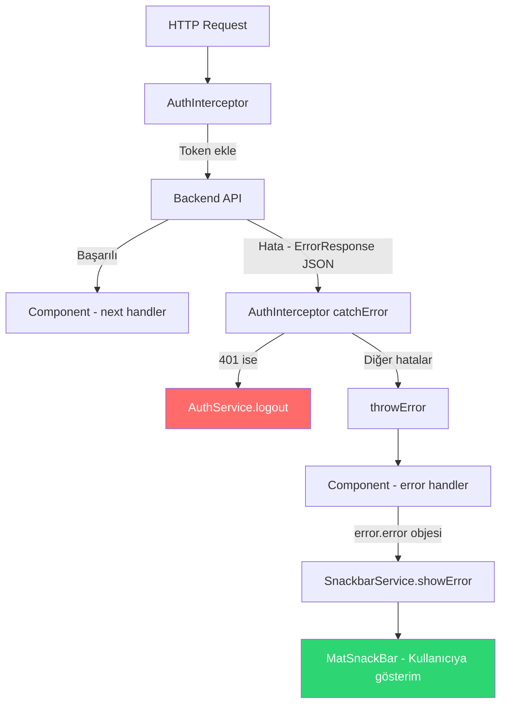
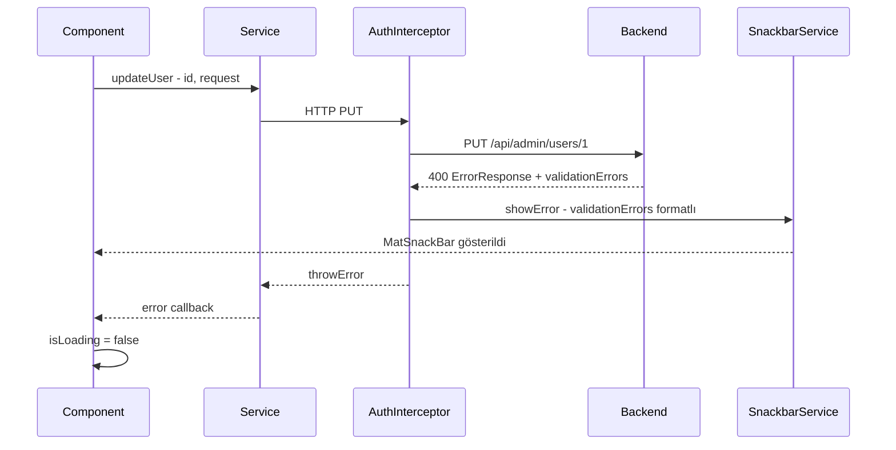
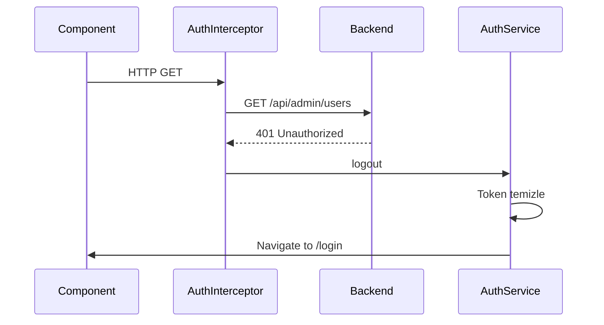
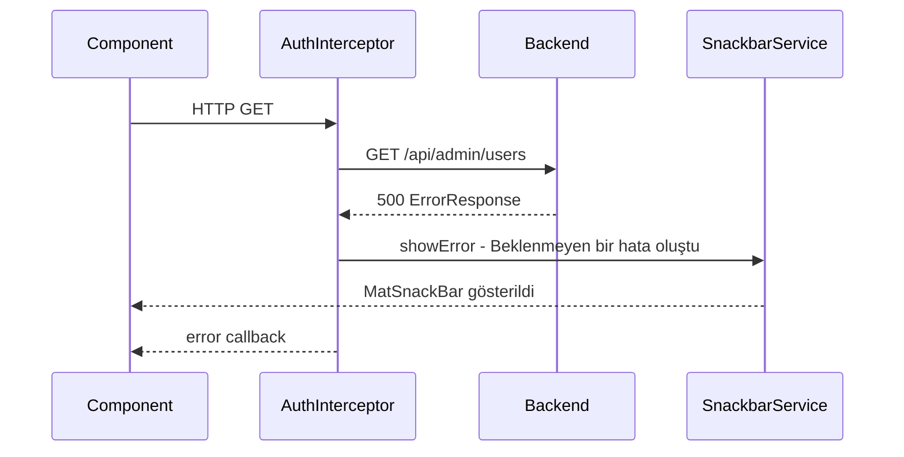

# Merkezi Hata Yönetim Sistemi — Detaylı Plan

## Mevcut Durum

Backend `GlobalExceptionHandler` ile tüm hataları standart `ErrorResponse` DTO'suna dönüştürüyor. Ancak frontend bu yapıyı tanımıyor ve hataları sadece `console.error` ile logluyor — kullanıcıya hiçbir feedback verilmiyor.

### Backend ErrorResponse Yapısı

```json
// Basit hata (business exception, generic exception)
{
  "statusCode": 400,
  "message": "Kullanıcı adı zaten mevcut",
  "timestamp": "2025-01-01T12:00:00",
  "validationErrors": null
}

// Validation hatası (MethodArgumentNotValidException)
{
  "statusCode": 400,
  "message": "validation hatası",
  "timestamp": "2025-01-01T12:00:00",
  "validationErrors": [
    { "field": "username", "message": "zorunlu alan" },
    { "field": "email", "message": "geçersiz format" }
  ]
}
```

---

## Hedef Mimari



---

## Phase 1: Error Model Oluşturma

### Adım 1.1: `models/error.model.ts`

Backend'in DTO yapılarına birebir karşılık gelen TypeScript interface'leri:

```typescript
// Backend: ValidationErrorResponse.java
export interface ValidationErrorResponse {
  field: string;
  message: string;
}

// Backend: ErrorResponse.java
export interface ErrorResponse {
  statusCode: number;
  message: string;
  timestamp: string;        // LocalDateTime → ISO string
  validationErrors: ValidationErrorResponse[] | null;
}
```

**Neden?** Backend'den dönen JSON'u tip güvenli şekilde parse edebilmek için. `any` kullanmak yasak (rules.md kural 6).

---

## Phase 2: Snackbar Service Oluşturma

### Adım 2.1: `core/services/snackbar.service.ts`

Tüm bildirimleri merkezi yöneten service. MatSnackBar'ı wrap ederek tutarlı görünüm sağlar.

```typescript
@Injectable({ providedIn: 'root' })
export class SnackbarService {
  constructor(private snackBar: MatSnackBar) {}

  showError(message: string, duration: number = 5000): void { ... }
  showSuccess(message: string, duration: number = 3000): void { ... }
  showWarning(message: string, duration: number = 4000): void { ... }
}
```

**Özellikler:**
- Hata mesajları kırmızı background, başarı mesajları yeşil
- Default duration: hatalar 5sn, başarı 3sn
- Türkçe fallback mesajlar
- MatSnackbar'ın `verticalPosition: 'top'` konumlandırması

**Neden ayrı service?** MatSnackBar'ı doğrudan interceptor içinde kullanmak mümkün ama merkezi bir service sayesinde tüm component'ler de tutarlı bildirim gösterebilir.

---

## Phase 3: Component Hata Yönetimi Güncellemesi

AuthInterceptor zaten var ve 401'i yakalıyor. Yeni bir ErrorInterceptor eklemek yerine, mevcut interceptor yaklaşımını genişletmek daha temiz olur. Ancak rules.md'deki iskelet yapısına uygun kalmak için **iki yaklaşım var:**

### Yaklaşım A: Mevcut AuthInterceptor'ı Genişlet (Tavsiye Edilen)

AuthInterceptor'ın `catchError` bloğunu zenginleştir:

```
catchError((error: HttpErrorResponse) => {
  // 401 → logout (mevcut)
  // Diğer → ErrorResponse parse et + SnackbarService ile göster
  //         + throwError ile component'e de ilet
})
```

**Artıları:** Tek interceptor, basit yapı, değişiklik minimum
**Eksileri:** AuthInterceptor'ın sorumluluğu artıyor

### Yaklaşım B: Ayrı ErrorInterceptor Oluştur

Yeni `error.interceptor.ts` oluştur, interceptor chain'de AuthInterceptor'dan sonra çalışır.

**Artıları:** Separation of concerns, her interceptor tek sorumluluk
**Eksileri:** İki interceptor'ın koordinasyonu gerekir, HTTP_INTERCEPTOR_PROVIDERS sırası önemli

### Karar: Yaklaşım A

Mevcut yapıda interceptor zaten `catchError` ile tüm hataları yakalıyor. Ayrı bir ErrorInterceptor eklemek, hataları iki kez yakalama riski doğurur. AuthInterceptor'ı genişletmek daha güvenli.

---

## Phase 4: Component Güncellemeleri

### 4.1: Login Component

**Mevcut:**
```typescript
error: (error) => {
  this.errorMessage = 'Login failed. Please check your credentials.';
}
```

**Yeni:**
```typescript
error: (error: HttpErrorResponse) => {
  // Interceptor zaten SnackbarService ile gösterdi
  // Ama login sayfasında form içinde de göstermek isteyebiliriz
  const errorResponse = error.error as ErrorResponse;
  this.errorMessage = errorResponse?.message ?? 'Giriş başarısız. Lütfen bilgilerinizi kontrol edin.';
}
```

**Not:** Login sayfası özel bir durum çünkü hata mesajı formun altında gösteriliyor, Snackbar ile değil. Diğer tüm sayfalarda sadece SnackbarService yeterli.

### 4.2: Dialog Component'leri (change-password, update-user)

**Mevcut:**
```typescript
error: (error) => {
  this.isLoading = false;
  console.error('Password update failed:', error);
}
```

**Yeni:**
```typescript
error: (error: HttpErrorResponse) => {
  this.isLoading = false;
  // Interceptor zaten Snackbar ile gösterdi
  // Dialog açık kalsın, kullanıcı tekrar deneyebilsin
}
```

isLoading = false kalmalı çünkü dialog'da loading state'i yönetiliyor. console.error kaldırılabilir.

### 4.3: Admin Users Component

**Mevcut:**
```typescript
error: (error: Error) => {
  console.error('Error loading users:', error);
}
```

**Yeni:**
```typescript
error: (error: HttpErrorResponse) => {
  // Interceptor zaten Snackbar ile gösterdi
  // Tablo boş kalacak, kullanıcı sayfayı yenileyebilir
}
```

---

## Akış Diyagramı — Hata Senaryoları

### Senaryo 1: 400 Validation Hatası (form submit)


### Senaryo 2: 401 Unauthorized


### Senaryo 3: 500 Internal Server Error


---

## Interceptor Genişletme Detayı

```typescript
// auth.interceptor.ts — genişletilmiş catchError
catchError((error: HttpErrorResponse) => {
  // 401 → logout (mevcut davranış)
  if (error.status === 401) {
    this.authService.logout();
  }

  // ErrorResponse parse et
  let errorMessage = 'Beklenmeyen bir hata oluştu.';
  
  if (error.error?.statusCode) {
    const errorResponse = error.error as ErrorResponse;
    
    // Validation error'ları formatla
    if (errorResponse.validationErrors && errorResponse.validationErrors.length > 0) {
      const validationMessages = errorResponse.validationErrors
        .map(ve => `${ve.field}: ${ve.message}`)
        .join(', ');
      errorMessage = `${errorResponse.message} — ${validationMessages}`;
    } else {
      errorMessage = errorResponse.message;
    }
  } else if (error.status === 0) {
    errorMessage = 'Sunucuya ulaşılamıyor. Bağlantınızı kontrol edin.';
  } else if (error.status === 403) {
    errorMessage = 'Bu işlem için yetkiniz yok.';
  } else if (error.status === 404) {
    errorMessage = 'İstenen kaynak bulunamadı.';
  }

  this.snackbarService.showError(errorMessage);
  return throwError(() => error);
})
```

---

## Değişecek Dosyalar Özeti

| Dosya | İşlem | Açıklama |
|---|---|---|
| `models/error.model.ts` | **YENİ** | ErrorResponse + ValidationErrorResponse interface'leri |
| `core/services/snackbar.service.ts` | **YENİ** | Merkezi bildirim service'i |
| `core/interceptors/auth.interceptor.ts` | **GÜNCELLE** | ErrorResponse parse + SnackbarService entegrasyonu |
| `core/core.module.ts` | **KONTROL** | MatSnackBarModule import'u gerekli mi kontrol et |
| `features/login/components/login.component.ts` | **GÜNCELLE** | Backend mesajını kullan, Türkçe fallback |
| `features/admin/components/change-password-dialog.component.ts` | **GÜNCELLE** | console.error kaldır, isLoading koru |
| `features/admin/components/update-user-dialog.component.ts` | **GÜNCELLE** | console.error kaldır, isLoading koru |
| `features/admin/components/admin-users.component.ts` | **GÜNCELLE** | console.error kaldır |

---

## Uygulama Sırası

1. **Adım 1:** `models/error.model.ts` oluştur → Kullanıcıya sor: devam edeyim mi?
2. **Adım 2:** `core/services/snackbar.service.ts` oluştur → Kullanıcıya sor: devam edeyim mi?
3. **Adım 3:** `core/interceptors/auth.interceptor.ts` güncelle → Kullanıcıya sor: devam edeyim mi?
4. **Adım 4:** Component'leri güncelle (login, dialog'lar, admin-users) → Kullanıcıya sor: devam edeyim mi?
5. **Adım 5:** Test senaryoları ile doğrula

Her adımda rules.md kural 4'e uygun olarak kullanıcı onayı istenecek.
